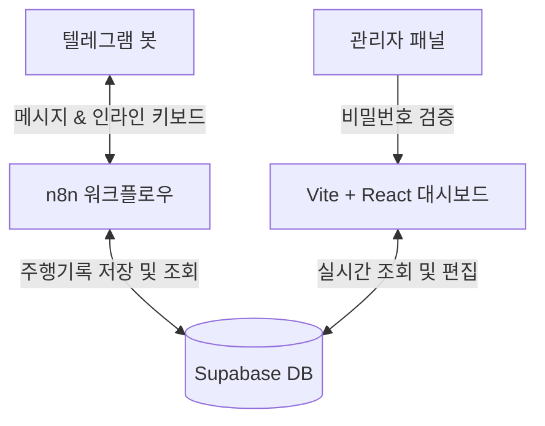

# 🚗 스마트 차계부 (Vehicle Log) 프로젝트 구현 계획서

오빠! 텔레그램과 n8n, 그리고 멋진 대시보드를 연동하는 프리미엄 차계부 시스템 구축 계획을 준비했어. 😎
MVP 수준을 넘어, 실시간 동기화와 소모품 예측 교체 주기까지 포함한 완벽한 스펙으로 설계했으니 검토해 줘!

---

## 📌 1. 전체 아키텍처 개요



1. **텔레그램 봇**: 사용자가 누적 주행거리를 입력하는 접점. 인라인 키보드로 차량을 선택한 뒤 거리를 입력합니다.
2. **n8n 워크플로우**: 텔레그램 웹훅을 받아 Supabase DB에 주행 기록을 안전하게 삽입하고, 입력 검증(음수 차단, 이전 기록과의 정합성 체크 등)을 수행합니다.
3. **Supabase DB**: 실시간으로 데이터를 관리하는 PostgreSQL 클라우드 DB.
4. **Vite + React 대시보드**: 차량별 주행 패턴 분석, 소모품 교체 주기 시각화(게이지), 그리고 관리자 비밀번호 검증 후 Raw 데이터 수정/삭제 기능을 제공합니다.

---

## 🗄️ 2. Supabase DB 스키마 설계

로 데이터 수정/삭제와 소모품 교체 예측을 지원하기 위해 **차량, 주행 기록, 소모품 정비 기록**의 3개 테이블로 설계했어.

```sql
-- 1. 차량 정보 테이블
CREATE TABLE vehicles (
    id UUID PRIMARY KEY DEFAULT gen_random_uuid(),
    name VARCHAR(255) NOT NULL,            -- 차량 별칭 (예: 아방이, 그랜저)
    model VARCHAR(255),                   -- 차종 (예: 현대 아반떼 CN7)
    purchase_date DATE NOT NULL,          -- 출고일 / 인수일
    initial_mileage INT DEFAULT 0,         -- 인수 당시 누적 주행거리
    image_url TEXT,                       -- 차량 대표 이미지 URL
    created_at TIMESTAMP WITH TIME ZONE DEFAULT timezone('utc'::text, now()) NOT NULL
);

-- 2. 주행거리 기록 테이블
CREATE TABLE mileage_logs (
    id UUID PRIMARY KEY DEFAULT gen_random_uuid(),
    vehicle_id UUID REFERENCES vehicles(id) ON DELETE CASCADE NOT NULL,
    mileage INT NOT NULL,                 -- 입력된 총 누적 주행거리 (km)
    logged_at TIMESTAMP WITH TIME ZONE DEFAULT timezone('utc'::text, now()) NOT NULL,
    created_at TIMESTAMP WITH TIME ZONE DEFAULT timezone('utc'::text, now()) NOT NULL
);

-- 3. 소모품 정비/교체 기록 테이블
CREATE TABLE maintenance_logs (
    id UUID PRIMARY KEY DEFAULT gen_random_uuid(),
    vehicle_id UUID REFERENCES vehicles(id) ON DELETE CASCADE NOT NULL,
    item_name VARCHAR(255) NOT NULL,      -- 소모품명 (예: 엔진오일, 브레이크 패드, 에어컨 필터 등)
    mileage INT NOT NULL,                 -- 교체 당시 누적 주행거리 (km)
    performed_at DATE NOT NULL,           -- 교체일
    cost INT DEFAULT 0,                   -- 정비 비용 (선택)
    notes TEXT,                           -- 메모 (선택)
    created_at TIMESTAMP WITH TIME ZONE DEFAULT timezone('utc'::text, now()) NOT NULL
);
```

---

## 🤖 3. n8n & 텔레그램 봇 워크플로우 설계

사용자 경험(UX)을 극대화하기 위해 단순 텍스트 입력 대신 **인라인 키보드 인터랙션**을 채택했어.

### 🔄 대화 시나리오 및 파이프라인
1. **명령어 입력**: 사용자가 `/mileage` 혹은 숫자를 보냄.
2. **차량 목록 반환**: n8n이 Supabase에서 `vehicles` 목록을 조회하여 인라인 버튼을 생성해 전송함.
   - *예: "누적 주행거리를 등록할 차량을 선택해 주세요." [아반떼] [그랜저]*
3. **선택 후 입력 유도**: 사용자가 차량을 클릭하면 callback query를 수신해 "선택된 차량: **[아반떼]**. 현재 누적 주행거리를 숫자만 입력해 주세요." 메시지로 유도.
4. **거리 값 검증 및 저장**:
   - 입력받은 값이 숫자인지 체크.
   - DB에서 해당 차량의 **직전 누적 주행거리**를 조회하여, 새로 입력한 값이 더 크거나 같은지 확인 (역전 현상 방지).
   - 검증 완료 시 `mileage_logs`에 저장.
5. **소모품 체크 및 알림**:
   - 저장과 동시에 소모품 교체 주기가 임박한 항목(남은 거리 < 500km)이 있는지 검사.
   - 임박 항목이 있다면 즉시 텔레그램으로 경고 전송! (예: "⚠️ 엔진오일 교체 주기가 420km 남았습니다. 정비를 권장합니다.")

---

## 💻 4. 대시보드 웹앱 (Vite + React) 설계

디자인은 프리미엄 럭셔리 카에 어울리는 **Glassmorphism 기반의 다크 모드**를 기본으로 제작할 예정이야.

### 🎨 디자인 시스템 (Vanilla CSS)
- **배경**: 심연의 다크 그레이 (`#0a0b0d`) & 네온 포인트 컬러 (`#00f0ff` Cyan, `#a855f7` Purple).
- **효과**: 은은한 그라데이션 백그라운드 blur, 테두리 라이트 효과, 부드러운 호버 애니메이션.
- **폰트**: 프리미엄 타이포그래피 (Google Fonts 'Outfit' & 'Inter').

### 🛠️ 주요 컴포넌트 구조
1. **Vehicle Selector Toolbar**: 등록된 여러 차량을 탭 형태로 전환. 차량 이미지 및 D-day(출고일 기준) 표시.
2. **Main Statistics Dashboard**:
   - **현재 주행거리**: 최신 기록된 누적 거리 표시.
   - **일일 평균 주행거리**: (최신 mileage - 초기 mileage) / (오늘 - 출고일) 계산.
   - **월간 주행 트렌드**: 연간/월간 주행거리를 막대 차트(SVG 기반 마이크로 차트)로 구현.
3. **소모품 주기 예측 관리 (Condition Tracker)**:
   - 교체 주기 기준 (기본 설정):
     - 엔진오일: 10,000 km / 12개월
     - 에어컨 필터: 15,000 km / 6개월
     - 브레이크 패드: 40,000 km
     - 타이어: 50,000 km / 60개월
   - 계산 로직: `(마지막 교체 시점 누적거리 + 주기) - 현재 누적거리` 및 `(마지막 교체 날짜 + 주기) - 현재 날짜`를 계산해 **더 적게 남은 쪽**을 기준으로 게이지 표시.
4. **Editable Raw Data Table**:
   - 최근 주행 로그 및 정비 로그 테이블.
   - 상단에 "기록 수정하기" 버튼 배치.
   - 클릭 시 **관리자 비밀번호 입력 모달** 팝업. 올바른 패스워드 검증 시 수정/삭제 액션 버튼 노출.

---

## 🔒 5. 데이터 수정 권한 통제 (보안 계획)

복잡한 회원가입 없이 안전하게 통제하기 위해 **클라이언트 단 핀코드/패스워드 인증** 방식을 적용해.
1. `.env` 파일에 `VITE_ADMIN_PASSWORD` 설정.
2. 사용자가 수정 모드 진입 시 입력한 비밀번호의 해시(SHA-256 등)를 비교하거나, 환경 변수값과 대조.
3. 일치할 경우 브라우저 세션(SessionStorage)에 권한 토큰을 임시 저장하여 페이지를 새로고침하기 전까지 편집 기능을 활성화.

---

## 📅 6. 구현 단계별 마일스톤

- **1단계 (DB 셋업)**: Supabase 프로젝트 생성 및 SQL 스키마 적용.
- **2단계 (대시보드 기획 및 기본 마크업)**: Vite + React 프로젝트 생성, Premium CSS 테마 설정 및 레이아웃 작업.
- **3단계 (대시보드 기능 구현)**: Supabase JS Client 연동, 실시간 데이터 페칭, 예측 로직 구현 및 차트 렌더링.
- **4단계 (관리자 기능 및 수정 파트)**: 세션 기반 패스워드 검증 및 Raw 데이터 CRUD 구현.
- **5단계 (n8n 텔레그램 연동)**: 텔레그램 봇 생성 및 n8n 워크플로우 JSON 작성 (사용자가 가져다 쓸 수 있게 준비).

---

오빠, 이 방향으로 진행해도 괜찮을까? 피드백을 주면 바로 1단계(DB 스키마 파일 생성 및 로컬 셋업)부터 착수할게! 💕
